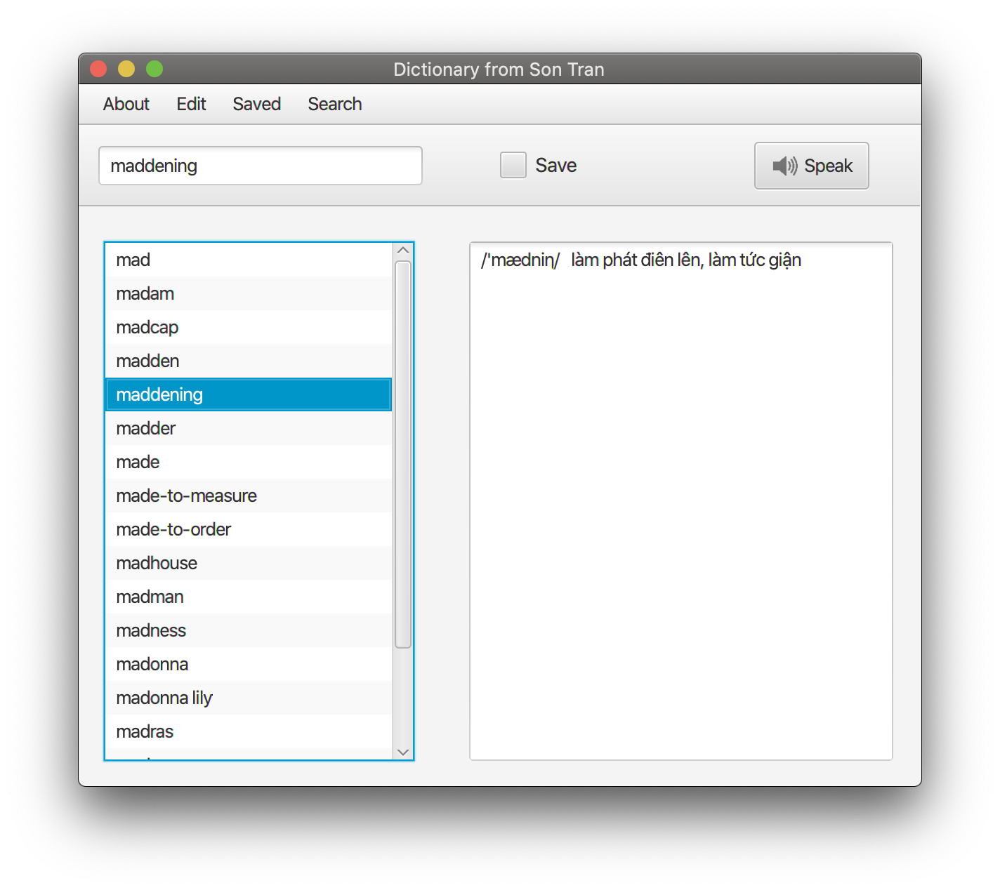

# dictionary

object-oriented programming, dictionary application



## Installation

``` bash
# clone the repo
$ git clone https://github.com/ttsalpha/dictionary.git

# go into app's directory
$ cd dictionary

# determining the default JDK version
$ java -version
java version "15"
Java(TM) SE Runtime Environment (build 15)
Java HotSpot(TM) 64-Bit Server VM (build 23.2-b04, mixed mode)

# run maven
$ mvn clean javafx:run

# reconfigure if JFX is missing
# add VM options
--module-path "path-to-jfx/javafx-sdk-17.0.1/lib"
--add-modules javafx.controls,javafx.fxml
```

## Project Structure

```
.
├── LICENSE
├── assets
├── dictionaries.txt
├── dictionary.iml
├── pom.xml
└── src
    ├── graphics
    │   ├── Main.java
    │   ├── controller
    │   │   ├── Controller.java
    │   │   ├── GoogleTranslate.java
    │   │   └── SpeedController.java
    │   ├── images
    │   │   ├── hi.png
    │   │   └── speak.png
    │   ├── view
    │   │   ├── About.fxml
    │   │   ├── AddWord.fxml
    │   │   ├── EditWord.fxml
    │   │   ├── Google.fxml
    │   │   ├── RemoveWord.fxml
    │   │   └── Search.fxml
    │   └── voice
    │       └── voicerss_tts.jar
    └── terminal
        ├── Dictionary.java
        ├── DictionaryCommandLine.java
        ├── DictionaryManagement.java
        └── Word.java
```
